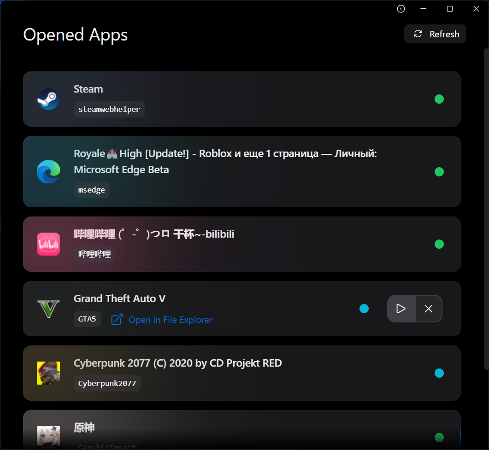

# GPause 2

Puts your opened apps and games to sleep 🛏️

### Why?

- Brings mobile-like background app suspend to Windows 📱🤝🖥️
- Saves CPU, GPU usage, and for laptops, battery life 🔋
- Console-like quick pause & resume experience 🎮
- Eliminates the need to close apps to fix lag ❌
- Skip the long wait for large apps to startup from scratch 🚀

### Preview

<picture>
  <source
    srcset="./screenshots/dark.png"
    media="(prefers-color-scheme: dark)"
  />
  <source
    srcset="./screenshots/light.png"
    media="(prefers-color-scheme: light), (prefers-color-scheme: no-preference)"
  />
  
</picture>

---

Requires Windows 10 or newer.

Mac & Linux support may or may not come in the future depending on various dependencies.
